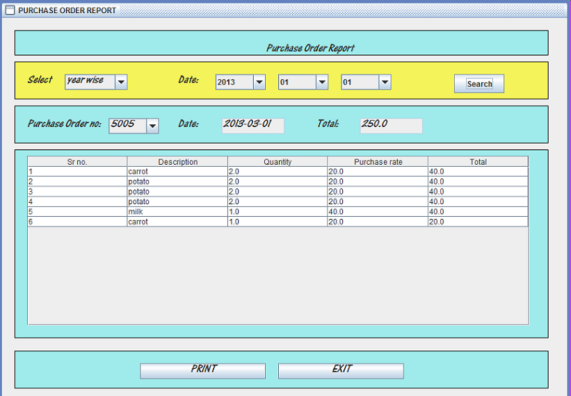

Restaurant Management System
===================================
1. This project is standalone Restaurant Management System developed in Java.  
2. system is fully automated system. No manual or handwritten work is required.	
3. It is computerized system, therefore there is no need of register to be maintained.
4. Data will be safe in database.
5. By login-password facility only the Owner or Manager can add or delete the important information.
6. Just by giving the Menu Name, the whole information displayed within a second , so time require to retrieve Menu information or stock information is negligible.
7. At any time we can see stock record of raw items, available Menu Items and table status etc.
8. Updating the information or stock details become easy and quick.
9. Data cannot be lost and remains safe.
10. Primary objective of the proposed system is to overcome the drawbacks of existing system. 
11. The proposed system provides Login Facility i.e. with user name &     Password which provide the data security.
12. The proposed system provides time to time reports. The system keeps record of each transaction. System allows possible modification of records.

SCREENSHOTS:

